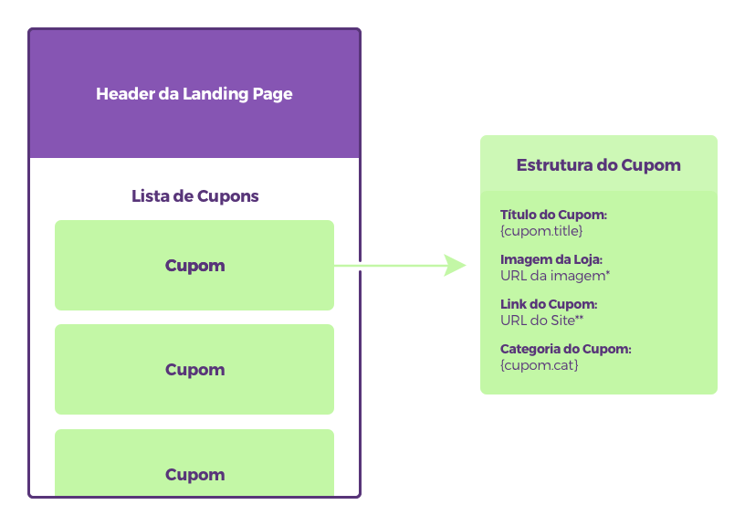

# Teste para Dev Front-End Junior - Landing Page
## Tarefas do Teste
Esse teste tem como objetivo testar as habilidades do candidato para lidar com projetos. 
Seu objeto é fazer uma landing page para o Cuponomia contendo:

* Um header para explicar melhor para o usuário o conteúdo e o propósito da landing;
* Uma lista de cupons de descontos alimentada pelas informações do arquivo `src/data/cupom.js` (ver mais da estrutura básica do cupom [na sessão abaixo](#estrutura-básica-da-página));
* Um aviso na página para o usuário de que ele será redirecionado para o site do Cuponomia após o usuário clicar no link do cupom e antes de ele ser redirecionado para a URL do link;
* A página tem que ser com layout responsivo e/ou fluido para ser bem visualizada tanto em mobile quanto em desktop.

### Observações
* **Não** é necessário seguir a identidade visual e o layout do cupom atual do Cuponomia. Seguir uma linha diferente é um bônus;
* Suporte para os principais navegadores modernos em suas últimas versões (Chrome, Firefox, Safari, Edge).

### Estrutura básica da página

*URL da Imagem: `https://cuponomia-a.akamaihd.net/img/stores/medium/{cupom.slug}.png` (disponível nos tamanhos small, medium e original);

**URL do Site: `https://www.cuponomia.com.br/desconto/{cupom.slug}?c={cupom.id}`

##  Instalação
* Instale o [Node.JS](https://nodejs.org/en/);
* Clone o repositório `https://github.com/rafaelpradella/front-jr-test.git` ou `git@github.com:rafaelpradella/front-jr-test.git`;
* Vá até a pasta do projeto com `cd front-jr-test`;
* Instale as dependências do projeto com `npm install`. Se você utilizar macOS ou Linux, talvez precise colocar `sudo` na frente do comando.

## Rodando em Local
* Acesse a pasta **front-jr-test** e rode o comando `npm run local` para gerar os arquivos;
* No browser, acesse o endereço `http://localhost:3000`;

**(Se algum outro passo for necessário para rodar a sua aplicação, insira aqui)**

## Prazo do Teste
No máximo 7 dias, contando a partir da hora em que o link e acesso ao repositório foi compartilhado para você;

## Dúvidas?
Mande email para <rafael@cuponomia.com.br> se houver alguma dúvida sobre o teste em si ou sobre a instalação que responderei o mais rápido possível.
